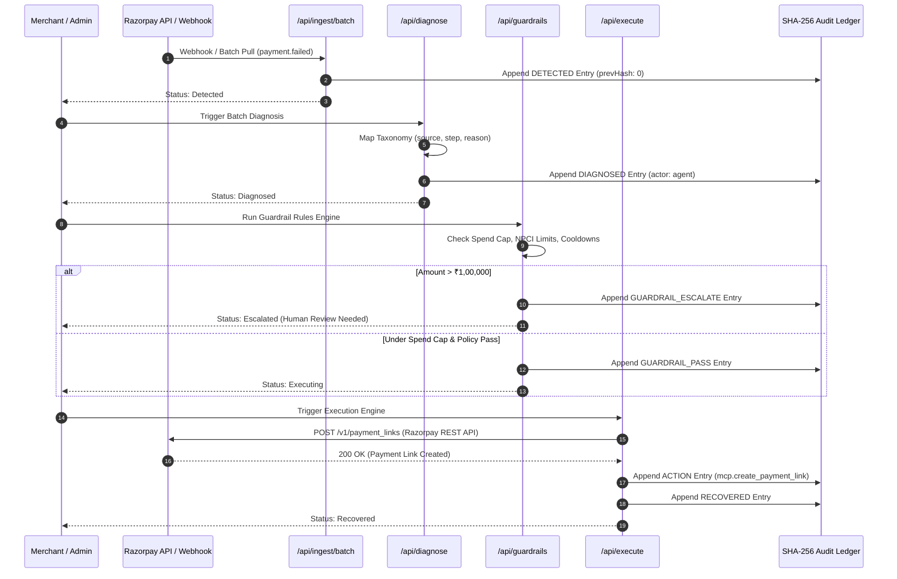

# 🛡️ Reclaim — Autonomous Revenue Recovery Control Tower

> **An autonomous, policy-bounded revenue recovery agent built for Razorpay merchants.**

---

## 🎯 The Problem in One Line

**Over 20% of digital revenue leaks silently through payment failures, abandoned checkouts, and broken mandates — while merchants lack transparent diagnosis, compliance boundaries, and verifiable audit trails.**

---

## 💥 Why This Matters

In online commerce, **failed transactions are not just lost sales — they are damaged customer relationships**. When a payment fails, merchants typically face three severe issues:
1. **Silent Revenue Attrition**: Up to ₹1 out of every ₹5 at risk disappears without any active recovery mechanism.
2. **Customer Spam & Churn**: Retrying transactions blindly using generic drip emails irritates users and increases churn.
3. **Compliance Risk**: Uncontrolled retries on recurring mandates violate banking guidelines, leading to merchant penalties.

Reclaim transforms revenue recovery from a manual, blunt-instrument process into an **autonomous, deterministic, and cryptographically auditable control tower**.

---

## 🧅 Three Layers of the Problem

```
+-----------------------------------------------------------------------+
|  LAYER 1: CONVERSION & REVENUE LEAKAGE                                |
|  Card declines, bank timeouts, 3DS drop-offs, abandoned checkout      |
|  carts, and unpaid B2B invoices disappearing without detection.       |
+-----------------------------------------------------------------------+
                                   |
                                   v
+-----------------------------------------------------------------------+
|  LAYER 2: REGULATORY & POLICY BOUNDARIES                              |
|  Mandate retries breaching NPCI rules, lack of cooldown enforcement,   |
|  and firing automated communications during DND hours.               |
+-----------------------------------------------------------------------+
                                   |
                                   v
+-----------------------------------------------------------------------+
|  LAYER 3: RISK, AUDITABILITY & FINANCIAL CONTROL                      |
|  Black-box AI decisions executing high-value transactions (>₹1,00,000)|
|  without human approval or tamper-evident verification.               |
+-----------------------------------------------------------------------+
```

1. **Layer 1 — Operational Conversion Leakage**: Payment drop-offs happen in distinct stages (authentication vs. banking response). Treating all failures identically fails to recover recoverable transactions.
2. **Layer 2 — Regulatory & Policy Compliance**: Central banks and UPI networks enforce strict limits on retry frequencies (e.g. 1+3 retry cap for NPCI mandates). Ignorance of policy rules leads to account suspension.
3. **Layer 3 — Audit & Financial Risk**: Finance teams demand verifiable logs. Black-box LLMs that take uninspected actions introduce compliance risks that traditional enterprises cannot accept.

---

## 💡 The Solution

Reclaim is an **autonomous revenue recovery agent** designed specifically for Razorpay merchants:

- 📡 **Signal Ingestion**: Pulls real payment failures, abandoned checkouts, and mandate errors from Razorpay REST APIs and webhooks.
- 🧠 **Deterministic Diagnosis**: Classifies failures against Razorpay's exact error taxonomy (`error_source`, `error_step`, `error_reason`).
- 🛡️ **Bounded Policy Engine**: Evaluates NPCI retry caps, spend thresholds, cooldown periods, and human approval gates *before* taking action.
- ⚙️ **Razorpay API Execution**: Automatically issues targeted Razorpay payment links and schedules mandate retries.
- 🔐 **SHA-256 Audit Ledger**: Seals every decision, approval, block, or action into a cryptographically linked hash chain.

---

## ✨ What Makes Reclaim Unique

| Feature | Traditional Recovery | Black-Box AI Bots | **Reclaim Control Tower** |
|---|---|---|---|
| **Diagnosis** | None (Generic retry) | Non-deterministic LLM prompt | **Transparent Razorpay Error Taxonomy Rules** |
| **Safety** | Unbounded | Hallucinated actions | **Deterministic Guardrail Policy Engine** |
| **Auditability** | DB logs (editable) | System prompt logs | **Cryptographic SHA-256 Hash Chain** |
| **Compliance** | Manual | Ignored | **Enforced NPCI 1+3 Mandate Retry Limits** |
| **Human Control** | All or nothing | No human-in-the-loop | **Automatic Escalation on Spend Caps (>₹1L)** |

---

## 🏗️ Technical Architecture

Reclaim is built as a modular Next.js 14 App Router application with strict separation between ingestion, policy evaluation, execution, and ledger auditing:

```
                  ┌─────────────────────────────────────────────────────────┐
                  │                 RECLAIM CONTROL TOWER                   │
                  └─────────────────────────────────────────────────────────┘
                                       │
        ┌──────────────────────────────┼──────────────────────────────┐
        ▼                              ▼                              ▼
  [ 📡 SIGNAL INGESTION ]   [ 🧠 DIAGNOSIS ENGINE ]     [ 🛡️ POLICY GUARDRAILS ]
   Pulls Razorpay failures   Maps error taxonomy         Enforces NPCI limits,
   & abandoned carts         (source/step/reason)        spend caps & cooldowns
        │                              │                              │
        └──────────────────────────────┼──────────────────────────────┘
                                       ▼
                   ┌──────────────────────────────────────┐
                   │    [ ⚙️ EXECUTION & SHA-256 AUDIT ]  │
                   │    Executes payment links & logs     │
                   │    cryptographic hash-chain entries  │
                   └──────────────────────────────────────┘
```

---

## 📐 System Architecture (ASCII Visualizations)

### 1. High-Level Event Lifecycle State Machine

```
+------------------+     +------------------+     +------------------+
|    DETECTED      | --> |    DIAGNOSED     | --> |    GUARDRAILS    |
| (Razorpay Event) |     | (Taxonomy Match) |     |  (Policy Engine) |
+------------------+     +------------------+     +------------------+
                                                           |
                                      +--------------------+--------------------+
                                      |                                         |
                                      v                                         v
                           +--------------------+                    +--------------------+
                           |     APPROVED       |                    |     STOPPED /      |
                           |   (requiresHuman   |                    |     ESCALATED      |
                           |      = false)      |                    |  (Policy Trigger)  |
                           +--------------------+                    +--------------------+
                                      |                                         |
                                      v                                         v
                           +--------------------+                    +--------------------+
                           |    EXECUTING       |                    |   HUMAN REVIEW     |
                           | (Razorpay API Call)|                    |  (Approval Gate)   |
                           +--------------------+                    +--------------------+
                                      |
                                      v
                           +--------------------+
                           |     RECOVERED      |
                           | (Payment Captured) |
                           +--------------------+
```

---

### 2. Autonomous Diagnosis & Error Taxonomy Mapping

```
                      +----------------------------------+
                      | Raw Ingested Event from Razorpay |
                      +----------------------------------+
                                       |
                   +-------------------+-------------------+
                   |                                       |
        [ error_source == 'customer' ]           [ error_source == 'bank' ]
        [ step == 'authentication'   ]           [ reason == 'technical'  ]
                   |                                       |
                   v                                       v
         Category: auth_failed                  Category: transient_bank
         Action: send_payment_link              Action: compliant_retry
         Confidence: 92%                        Confidence: 91%
                   |                                       |
                   +-------------------+-------------------+
                                       |
                                       v
                     +-----------------------------------+
                     |      Guardrail Policy Check       |
                     +-----------------------------------+
                                       |
            +--------------------------+--------------------------+
            |                                                     |
  [ Amount > ₹1,00,000 Cap ]                            [ Retries <= 3 Attempts ]
            |                                                     |
            v                                                     v
  Status: ESCALATED                                      Status: EXECUTING
  Requires Human Review                                  Call Razorpay API
```

---

### 3. Cryptographic SHA-256 Hash Chain Structure

```
+------------------------------------+      +------------------------------------+
| Audit Entry #1 (Genesis)           |      | Audit Entry #2                     |
+------------------------------------+      +------------------------------------+
| id: audit_001                      |      | id: audit_002                      |
| eventId: rev_101                   | ---> | eventId: rev_101                   |
| actor: system                      |      | actor: agent                       |
| decision: DETECTED                 |      | decision: DIAGNOSED                |
| prevHash: "0"                      |      | prevHash: "a7f3c9e2..." (Hash #1)  |
| hash: "a7f3c9e2..." (SHA-256)      |      | hash: "b8e4d0f3..." (SHA-256)      |
+------------------------------------+      +------------------------------------+
                                                              |
                                                              v
                                            +------------------------------------+
                                            | Audit Entry #3                     |
                                            +------------------------------------+
                                            | id: audit_003                      |
                                            | eventId: rev_101                   |
                                            | actor: guardrail                   |
                                            | decision: GUARDRAIL_PASS           |
                                            | prevHash: "b8e4d0f3..." (Hash #2)  |
                                            | hash: "c9f5e1a4..." (SHA-256)      |
                                            +------------------------------------+
```

---

## 🔄 Sequence Diagram



---

## 💻 Code Snippets & Ecosystem Integration

### 1. Razorpay REST API Client & Webhook Verification
```typescript
// lib/razorpay.ts — Real Razorpay API Calls
import { createHmac } from 'crypto'

export async function createPaymentLink(data: {
  amount: number
  currency: string
  description: string
  customer: { name?: string; email?: string; contact?: string }
}) {
  return razorpayFetch<{ id: string; short_url: string }>('/payment_links', {
    method: 'POST',
    body: JSON.stringify({
      amount: data.amount,
      currency: data.currency,
      description: data.description,
      customer: data.customer,
      notify: { sms: true, email: true },
    }),
  })
}

export function verifyWebhookSignature(payload: string, signature: string, secret: string): boolean {
  const expected = createHmac('sha256', secret).update(payload).digest('hex')
  return expected === signature
}
```

### 2. Rules-Based Error Taxonomy Classifier
```typescript
// lib/diagnosis.ts — Rules-Based Classifier
export const DIAGNOSIS_RULES: DiagnosisRule[] = [
  {
    id: 'R-001',
    category: 'auth_failed',
    confidence: 0.92,
    proposedAction: 'send_payment_link',
    condition: (e) => e.error_source === 'customer' && e.error_step === 'payment_authentication',
  },
  {
    id: 'R-002',
    category: 'transient_bank',
    confidence: 0.91,
    proposedAction: 'send_payment_link',
    condition: (e) => e.error_source === 'bank' && ['bank_technical_error', 'payment_timeout'].includes(e.error_reason ?? ''),
  },
]
```

### 3. Cryptographic SHA-256 Hash-Chain Engine
```typescript
// lib/audit.ts — SHA-256 Cryptographic Hash Computation
export function computeHash(params: {
  prevHash: string
  eventId: string
  actor: string
  decision: string
  createdAt: Date
}): string {
  const payload = [
    params.prevHash,
    params.eventId,
    params.actor,
    params.decision,
    params.createdAt.toISOString(),
  ].join('|')

  return createHash('sha256').update(payload).digest('hex')
}
```

---

## 🔌 Deployed Endpoints & API Route Directory

| Route | Method | Description |
|---|---|---|
| `/api/ingest/batch` | `POST` | Ingests failed payments & checkout drop-offs from Razorpay |
| `/api/diagnose` | `POST` | Executes rules table to diagnose root-cause categories |
| `/api/guardrails` | `POST` | Evaluates spend caps, cooldowns, and NPCI retries |
| `/api/execute` | `POST` | Invokes Razorpay REST API to issue payment links |
| `/api/ledger/[eventId]` | `GET` | Fetches chronological SHA-256 audit entry chain |
| `/api/ledger/[eventId]` | `POST` | Cryptographically verifies ledger hash integrity |
| `/api/analytics` | `GET` | Computes recovery rates & performance metrics |
| `/api/webhooks/razorpay`| `POST` | Signature-verified Razorpay event listener |

---

## 📁 Repository Structure

```
d:/reclaim/
├── app/
│   ├── api/                     # Next.js App Router API Routes
│   │   ├── analytics/           # Recovery analytics endpoint
│   │   ├── diagnose/            # Root cause classifier endpoint
│   │   ├── events/              # RevenueEvent CRUD endpoints
│   │   ├── execute/             # Razorpay API execution endpoint
│   │   ├── guardrails/          # Guardrail evaluation & config endpoints
│   │   ├── ingest/batch/        # Signal ingestion endpoint
│   │   ├── ledger/[eventId]/    # SHA-256 audit trail & verification
│   │   └── webhooks/razorpay/   # HMAC signature-verified webhook handler
│   ├── dashboard/               # Control Tower Frontend Screens
│   │   ├── analytics/           # Deep-dive analytics page
│   │   ├── cases/               # Kanban board & case detail pages
│   │   ├── guardrails/          # Interactive guardrail config page
│   │   └── page.tsx             # Main Control Tower dashboard
│   ├── globals.css              # Glassmorphism design system & typography
│   ├── layout.tsx               # Root app layout
│   └── page.tsx                 # Responsive marketing landing page
├── components/                  # Reusable UI & Visualization Components
│   ├── AuditLedger.tsx          # Interactive audit ledger timeline
│   ├── BatchRunButton.tsx       # Live pipeline execution trigger
│   ├── SankeyDiagram.tsx        # Animated SVG money-flow diagram
│   └── landing/                 # Landing page sections
├── lib/                         # Core Business Logic Engine
│   ├── audit.ts                 # SHA-256 hash-chain generator & verifier
│   ├── diagnosis.ts             # Rules-based diagnosis engine
│   ├── guardrails.ts            # Guardrails policy evaluator
│   ├── prisma.ts                # Prisma ORM client singleton
│   ├── razorpay.ts              # Razorpay REST API wrapper
│   └── types.ts                 # TypeScript interfaces & definitions
├── prisma/                      # Database Layer
│   ├── migrations/              # SQLite migrations
│   ├── schema.prisma            # Database models & relationships
│   └── seed.ts                  # Mock data seed script
├── tests/                       # Automated Test Suite (37 Tests)
│   ├── api/                     # API route unit tests
│   ├── integration/             # Full end-to-end loop integration test
│   ├── helpers.ts               # Test helpers & database seeders
│   └── setup.ts                 # Test environment setup
├── jest.config.js               # Jest configuration
├── package.json                 # Project dependencies & npm scripts
└── README.md                    # Project documentation
```

---

## 🛠️ Local Environment & Setup Guide

### 1. Prerequisites
- **Node.js**: v18.0.0 or higher
- **npm**: v9.0.0 or higher
- **Git**: Installed

### 2. Installation
```bash
git clone https://github.com/SamuelDharshi/Reclaim.git
cd Reclaim
npm install
```

### 3. Database Initialization & Seeding
```bash
npx prisma generate
npx prisma migrate dev --name init
npm run db:seed
```

### 4. Launch Development Server
```bash
npm run dev
```
Open **[http://localhost:3000](http://localhost:3000)** in your browser.

---

## 🧪 End-to-End Test Flow & Verification

Reclaim includes **37 automated integration tests** validating every pipeline stage:

```bash
# Run full test suite (--runInBand for isolated SQLite test.db)
npm test

# Run tests in watch mode
npm run test:watch

# Generate coverage report
npm run test:coverage
```

```
Test Suites: 8 passed, 8 total
Tests:       37 passed, 37 total
Snapshots:   0 total
Time:        71.18 s
```

---

## 📄 License

Built for the **Razorpay Buildathon**. Released under the MIT License.
