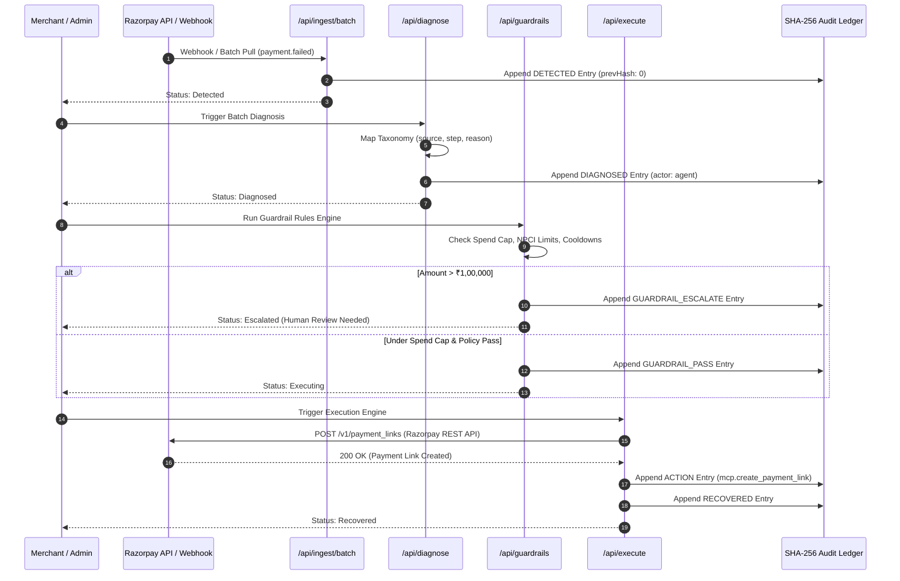

# 🛡️ Reclaim — Autonomous Revenue Recovery Control Tower

> **An autonomous, policy-bounded revenue recovery agent built for Razorpay merchants.**  
> Reclaim watches revenue leaking from failed card payments, abandoned checkouts, broken UPI autopay mandates, and overdue B2B invoices — diagnoses root causes using Razorpay's exact error taxonomy, enforces strict policy guardrails, executes recovery actions via Razorpay REST APIs, and audits every decision in a tamper-evident, SHA-256 hash-chained ledger.

---

## 💡 The Core Idea & Value Proposition

In online commerce, **15% to 25% of all payment transactions fail**. Payment drop-offs happen silently for diverse reasons — bank timeouts, OTP drop-offs, insufficient balance on recurring mandates, or simply forgotten checkouts.

Traditional recovery relies on blunt-instrument cron jobs, generic spam emails, or manual CSV exports. This leads to:
1. **Customer friction**: Spamming customers who had temporary bank outage errors.
2. **Regulatory & NPCI violations**: Excessive retries on recurring mandates breaching bank guidelines.
3. **Unbounded financial risk**: Automated actions firing on high-value ₹1,00,000+ invoices without human oversight.
4. **Zero auditability**: No verifiable proof of why an action was taken or stopped.

**Reclaim solves this with an Autonomous Control Tower Architecture:**

```
                  ┌─────────────────────────────────────────────────────────┐
                  │                 RECLAIM CONTROL TOWER                   │
                  └─────────────────────────────────────────────────────────┘
                                       │
        ┌──────────────────────────────┼──────────────────────────────┐
        ▼                              ▼                              ▼
  [ 📡 SIGNAL INGESTION ]   [ 🧠 DIAGNOSIS ENGINE ]     [ 🛡️ POLICY GUARDRAILS ]
   Pulls Razorpay failures   Maps error taxonomy         Enforces NPCI limits,
   & abandoned carts         (source/step/reason)        spend caps & cooldowns
        │                              │                              │
        └──────────────────────────────┼──────────────────────────────┘
                                       ▼
                   ┌──────────────────────────────────────┐
                   │    [ ⚙️ EXECUTION & SHA-256 AUDIT ]  │
                   │    Executes payment links & logs     │
                   │    cryptographic hash-chain entries  │
                   └──────────────────────────────────────┘
```

---

## 🎨 System Flow Architecture (ASCII Diagrams)

### 1. High-Level State Machine Flow

```
+------------------+     +------------------+     +------------------+
|    DETECTED      | --> |    DIAGNOSED     | --> |    GUARDRAILS    |
| (Razorpay Event) |     | (Taxonomy Match) |     |  (Policy Engine) |
+------------------+     +------------------+     +------------------+
                                                           |
                                      +--------------------+--------------------+
                                      |                                         |
                                      v                                         v
                           +--------------------+                    +--------------------+
                           |     APPROVED       |                    |     STOPPED /      |
                           |   (requiresHuman   |                    |     ESCALATED      |
                           |      = false)      |                    |  (Policy Trigger)  |
                           +--------------------+                    +--------------------+
                                      |                                         |
                                      v                                         v
                           +--------------------+                    +--------------------+
                           |    EXECUTING       |                    |   HUMAN REVIEW     |
                           | (Razorpay API Call)|                    |  (Approval Gate)   |
                           +--------------------+                    +--------------------+
                                      |
                                      v
                           +--------------------+
                           |     RECOVERED      |
                           | (Payment Captured) |
                           +--------------------+
```

---

### 2. Autonomous Decision Tree Matrix

```
                      +----------------------------------+
                      | Raw Ingested Event from Razorpay |
                      +----------------------------------+
                                       |
                   +-------------------+-------------------+
                   |                                       |
        [ error_source == 'customer' ]           [ error_source == 'bank' ]
        [ step == 'authentication'   ]           [ reason == 'technical'  ]
                   |                                       |
                   v                                       v
         Category: auth_failed                  Category: transient_bank
         Action: send_payment_link              Action: compliant_retry
         Confidence: 92%                        Confidence: 91%
                   |                                       |
                   +-------------------+-------------------+
                                       |
                                       v
                     +-----------------------------------+
                     |      Guardrail Policy Check       |
                     +-----------------------------------+
                                       |
            +--------------------------+--------------------------+
            |                                                     |
  [ Amount > ₹1,00,000 Cap ]                            [ Retries <= 3 Attempts ]
            |                                                     |
            v                                                     v
  Status: ESCALATED                                      Status: EXECUTING
  Requires Human Review                                  Call Razorpay API
```

---

### 3. Cryptographic SHA-256 Hash Chain Structure

Every decision, pass, block, or execution creates a cryptographic audit entry where each record's hash is computed from its previous record's hash.

```
+------------------------------------+      +------------------------------------+
| Audit Entry #1 (Genesis)           |      | Audit Entry #2                     |
+------------------------------------+      +------------------------------------+
| id: audit_001                      |      | id: audit_002                      |
| eventId: rev_101                   | ---> | eventId: rev_101                   |
| actor: system                      |      | actor: agent                       |
| decision: DETECTED                 |      | decision: DIAGNOSED                |
| prevHash: "0"                      |      | prevHash: "a7f3c9e2..." (Hash #1)  |
| hash: "a7f3c9e2..." (SHA-256)      |      | hash: "b8e4d0f3..." (SHA-256)      |
+------------------------------------+      +------------------------------------+
                                                              |
                                                              v
                                            +------------------------------------+
                                            | Audit Entry #3                     |
                                            +------------------------------------+
                                            | id: audit_003                      |
                                            | eventId: rev_101                   |
                                            | actor: guardrail                   |
                                            | decision: GUARDRAIL_PASS           |
                                            | prevHash: "b8e4d0f3..." (Hash #2)  |
                                            | hash: "c9f5e1a4..." (SHA-256)      |
                                            +------------------------------------+
```

---

## 🔄 End-to-End Sequence Diagram

### Mermaid Sequence Diagram



---

## 🛠️ Step-by-Step Installation & Run Guide

### Prerequisites
- **Node.js**: v18.0.0 or higher
- **npm**: v9.0.0 or higher
- **Git**: Installed and configured

---

### Step 1: Clone Repository & Install Dependencies

```bash
git clone https://github.com/SamuelDharshi/Reclaim.git
cd Reclaim
npm install
```

---

### Step 2: Configure Environment Variables

Reclaim uses two environment files:
1. `.env` — Read by Prisma CLI for local SQLite database connections.
2. `.env.local` — Read by Next.js server at runtime for Razorpay API keys and secrets.

Create `.env` in the root directory:
```ini
DATABASE_URL="file:./dev.db"
```

Create `.env.local` in the root directory:
```ini
DATABASE_URL="file:./dev.db"
RAZORPAY_KEY_ID="rzp_test_your_key_id"
RAZORPAY_KEY_SECRET="your_key_secret"
RAZORPAY_WEBHOOK_SECRET="test_webhook_secret"
NEXT_PUBLIC_APP_URL="http://localhost:3000"
```

> [!IMPORTANT]
> Never commit `.env.local` to Git. It is already added to `.gitignore`.

---

### Step 3: Initialize Database & Run Seed Script

Generate Prisma client, deploy SQLite migrations, and seed mock data:

```bash
npx prisma generate
npx prisma migrate dev --name init
npm run db:seed
```

The seed script initializes a default merchant record with guardrail configs and seeds sample events (`payment_failed`, `abandoned`, `mandate_failed`).

---

### Step 4: Launch Development Server

```bash
npm run dev
```

Open **[http://localhost:3000](http://localhost:3000)** in your browser.

---

### Step 5: Execute the Full Pipeline via Control Tower UI

1. Navigate to **[http://localhost:3000/dashboard](http://localhost:3000/dashboard)**.
2. Click the glowing **"Run Batch"** button in the top bar.
3. Observe real-time progress as events flow through **Ingest → Diagnose → Guardrails → Execute**.
4. View the **Sankey Diagram** update live with recovered revenue figures.
5. Click any case row to inspect the **SHA-256 Audit Ledger** and verify hash chain integrity.

---

## 🧪 Testing & Verification

Reclaim includes a comprehensive suite of **37 automated integration tests** covering unit behavior, database state changes, and live Razorpay test-mode calls.

### Run All Tests
```bash
npm test
```

### Run Tests in Watch Mode
```bash
npm run test:watch
```

### Run Test Coverage Report
```bash
npm run test:coverage
```

```
Test Suites: 8 passed, 8 total
Tests:       37 passed, 37 total
Snapshots:   0 total
Time:        71.18 s
```

---

## 📊 Modules & API Route Overview

| Module | Route | Purpose | Key Behavior |
|---|---|---|---|
| **Signal Ingestion** | `POST /api/ingest/batch` | Pulls failed payments & checkout drop-offs from Razorpay | Idempotent via `razorpayRefId` uniqueness check |
| **Root-Cause Diagnosis** | `POST /api/diagnose` | Classifies raw errors into taxonomy categories | Applies rule tables (`R-001` through `R-FALLBACK`) |
| **Guardrails Engine** | `POST /api/guardrails` | Evaluates spend caps, cooldowns, & NPCI rules | Sets status to `executing`, `escalated`, or `stopped` |
| **Execution Layer** | `POST /api/execute` | Calls Razorpay REST API to generate payment links | Creates real Razorpay `payment_links` in test mode |
| **Audit Ledger** | `GET /api/ledger/[eventId]` | Fetches SHA-256 audit entry chain | Returns chronological hash chain with `prevHash` |
| **Ledger Verification** | `POST /api/ledger/[eventId]` | Cryptographically verifies hash integrity | Recomputes hashes and returns `valid: true/false` |
| **Analytics Engine** | `GET /api/analytics` | Computes recovery metrics directly from DB | Calculates recovery rate %, avg time-to-recovery |
| **Razorpay Webhooks** | `POST /api/webhooks/razorpay` | Handles inbound Razorpay payment events | Validates HMAC-SHA256 signature header |

---

## 💻 Tech Stack

- **Framework**: Next.js 14 (App Router)
- **Language**: TypeScript
- **Database**: SQLite via Prisma ORM 5
- **Styling**: Tailwind CSS & Glassmorphism UI
- **Animations**: Framer Motion
- **State Management**: Zustand
- **Testing**: Jest & ts-jest
- **API Integration**: Razorpay REST API (Test Mode)

---

## 📄 License

Built for the **Razorpay Buildathon**. Licensed under the MIT License.
