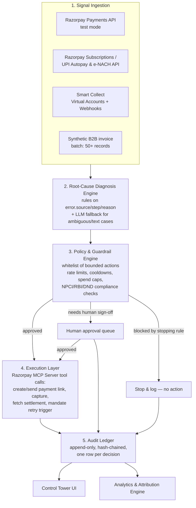

# Reclaim — The Revenue Recovery Control Tower
### A submission for the Razorpay AI Buildathon — Track 03: AI Revenue Recovery

**Author:** [Your name]
**Track:** AI Revenue Recovery (also cleanly extensible into Track 01 and Track 04)
**One-liner:** *An agent that watches every rupee leaking out of a Razorpay merchant's revenue — failed cards, broken UPI mandates, abandoned checkouts, overdue B2B invoices — decides the one right recovery move for each, executes it through Razorpay's own APIs, and shows its work in a control tower built like a bank ledger, not a chatbot.*

---

## 0. How to use this document

This is a working PRD, not a slide deck. Build in this order:
1. Read Section 3 (Why This Wins) once, out loud, with your team — it is your pitch script skeleton.
2. Build the Signal → Diagnose → Decide → Act → Audit loop (Section 7) before touching UI polish.
3. Wire the UI (Section 13) as a direct visual mirror of the state machine — do not build a generic dashboard first and bolt states onto it later.
4. Populate Section 15 (Metrics) with real numbers from your own test run before recording the pitch video — cherry-picked demos are explicitly penalized by the judges' rubric.
5. Use Section 17 as your day-by-day checklist.

---

## 1. Why this document exists

The brief you gave me was specific: don't bring "another checkout agent" to a room full of Razorpay engineers who will have seen fifty of them by lunchtime. You wanted something that:
- Feels like it came from *inside* Razorpay's own 2026 thinking, not from a generic "AI + payments" template.
- Wins on **UX-as-architecture** — the interface itself should *be* the system design, not a skin on top of it.
- Uses Razorpay's actual hard-built infrastructure in a way that would make the person who built that infrastructure feel *seen*, not copied.
- Is unmistakably **automation**, not a pretty dashboard with a manual "run" button.

I read the actual Buildathon page (razorpay.com/buildathon), Razorpay's 2026 Sprint and Agentic Payments material, their public engineering docs (error taxonomy, MCP server, Smart Collect, UPI Autopay/e-mandate rules), and recent coverage of their NPCI/Sarvam/superU agentic pilots. Everything below is built on top of what I found there — not a generic hackathon template. Sources are listed in the Appendix.

> **A note on "100% probability":** No idea guarantees a win — the rubric is judged by humans against other strong builders you can't see yet. What I *can* do is align this idea as tightly as possible with what Razorpay has publicly said it's looking for, in its own words, and make sure it clears the specific bar the buildathon page sets. That's what the rest of this document does.

---

## 2. What the Buildathon is actually judging (read this before building anything)

This is **not** a generic hackathon — it's Razorpay's hiring funnel for AI Builder Interns. The judges are the engineers and PMs who will potentially work with you. The page is unusually explicit about what "good" looks like, and most teams will under-read it. Track 03 (AI Revenue Recovery), verbatim bar:

> *"Don't just identify the problem. Show measured money recovered across a batch, with compliant escalation, stopping rules, and an audit trail."*

Break that sentence apart — it is a checklist:

| Rubric phrase | What it actually demands | Where this PRD addresses it |
|---|---|---|
| "measured money recovered" | Real numbers, not a claim | Section 15 |
| "across a batch" | Tested on a batch of synthetic transactions, not one lucky demo case | Section 15, 17 |
| "compliant escalation" | Respects DND/consent/RBI-NPCI retry rules | Section 9 |
| "stopping rules" | The agent knows when to *stop* trying, not just when to try | Section 9 |
| "audit trail" | Every action is explainable after the fact | Section 7.5, Section 13.3 |

And the cross-cutting bar repeated across every track on the page: *"Every money action explainable, bounded and gated. Show the audit trail and one failure handled gracefully."* This single sentence is effectively Razorpay's design philosophy for **all** of agentic payments right now (it's the same language they use publicly about UPI Reserve Pay and consent-based, pre-authorized, spend-capped agent transactions). Building a product whose UI *is* this sentence, made visible, is the single highest-leverage design decision in this PRD.

---

## 3. Why this wins (strategic alignment)

### 3.1 Why not the obvious idea
Track 01 (Agentic Commerce) is where the *herd* will go — it's the flashiest track, it mirrors Razorpay's own splashy Zomato/PVR/Sarvam/ChatGPT pilots, and a chatbot-that-buys-things is the first thing every team will think of. You'll be judged against 20 nearly identical "conversational checkout" demos. Track 03 is deliberately less glamorous, more operational, and far closer to what actually keeps a fintech's engineering leadership up at night: **money that already should have arrived but didn't.** Razorpay says this explicitly on the page: *"Revenue loss rarely happens in one clean step... This track surfaces the risk and ML-minded builders the others miss."*

### 3.2 Why this specific idea inside Track 03
Look at Track 03's own example directions again:
> *Payment degradation → root cause → recovery action, Checkout drop-off recovery, Failed-subscription recovery, B2B receivables chaser, Mandate retry sequencer, Hinglish voice recovery, Promise-to-pay tracker.*

Almost every team that picks this track will build **one** of these seven as a point solution (e.g., just a mandate retry bot). **Reclaim treats all seven as symptoms of the same underlying architecture** — a single diagnose → decide → act → audit loop with pluggable "failure surfaces." That's the differentiation: not a smarter point solution, but the *system* that makes every future point solution a five-line config, not a new codebase. This is what a Razorpay platform engineer would actually want to see: architectural thinking, not a clever demo.

### 3.3 The two questions you asked me to answer honestly

**"Does this use Razorpay's hard-built technology in a novel way that would make them feel good?"**
Yes, specifically:
- It uses the **official Razorpay MCP Server** (`razorpay/razorpay-mcp-server`, hosted at `mcp.razorpay.com`) not as a chat backend (the obvious use) but as the **execution arm of an autonomous policy engine** — the agent doesn't chat, it decides and calls MCP tools (`create_payment_link`, `send_payment_link` via SMS/email, `fetch_payment`, `fetch_settlement`) as governed actions with a guardrail check *in front of every call*. This is a genuinely different usage pattern from "AI assistant reads your dashboard," and it's exactly the "workflow automation" use case Razorpay lists as a first-class MCP use case in their own docs.
- It uses **Razorpay's real error taxonomy** (`error.source`, `error.step`, `error.reason`, `error.metadata` — the exact fields Razorpay's docs teach developers to build remedial logic on) as the backbone of the root-cause classifier, instead of training a black-box model. A Razorpay engineer will recognize their own field names immediately — that's the "wow, they actually read our docs" moment.
- It uses **Smart Collect / Virtual Accounts** for the B2B receivables surface exactly as designed (auto-reconciliation via unique virtual accounts/UPI IDs), and **UPI Autopay / e-mandate retry mechanics** (see Section 9) as *real* NPCI-compliant constraints, not invented rules — showing the judges you understand the regulatory rails their business runs on, not just their REST API.

**"Will this feel like it's going backward because it's not 'automation enough'?"**
No — and this is the most important design commitment in this PRD: **the control tower is a window into an agent that is already acting, not a queue of suggestions waiting for a human to click "do it."** Every case defaults to **autonomous execution inside a merchant-configured guardrail envelope**; a human only sees a case in the "needs approval" lane when the guardrail engine itself decides the action exceeds its authority (spend above a threshold, third escalation attempt, ambiguous root cause). That single design choice — *the agent acts by default, the human is the exception path, not the other way around* — is what separates this from a "dashboard with a bot bolted on" and makes it read as genuine automation.

---

## 4. Problem statement

Money leaks out of a growing Indian merchant's revenue in four places, each currently handled by a different half-manual process:

1. **Payment failures** — card declines, bank timeouts, OTP/3DS drop-offs. Razorpay's own error-code documentation exists *because* this is a widespread, structurally diagnosable problem — but most merchants only see "payment failed," not the "who/where/why" Razorpay's docs are built to expose.
2. **Checkout & cart abandonment** — a customer starts, gets distracted or hesitates, and never returns. No failure event is even fired — this is silence, not an error.
3. **Recurring payment (mandate) failures** — UPI Autopay/e-NACH debits fail due to insufficient balance or bank timing, and NPCI's 2026 rules now impose strict retry windows and non-peak execution constraints, making "just retry immediately" both non-compliant and ineffective.
4. **B2B receivables** — invoices go overdue because someone forgot, not because they refused to pay; recovering them today means a finance person manually cross-referencing bank statements against invoices and making phone calls.

Today these are four different tools, four different owners, and zero shared "audit trail of why we did what we did" — which is precisely the gap Track 03 calls out.

---

## 5. Product vision & design principles

1. **Explainable by default, not on request.** Every action carries a one-sentence "why" that's visible without a click, not buried in a log you have to go looking for.
2. **Bounded before it's built.** No action ships without a guardrail rule that could have stopped it. Guardrails are configured *before* the classifier is, not retrofitted.
3. **The UI is the state machine.** A case's column in the Kanban board is not decoration — it is the literal state of the backend object. If you can't map every UI element to a field in the data model, delete it.
4. **Boring where it matters, delightful where it doesn't.** Compliance and audit surfaces (Section 13.3) look like a bank passbook — calm, monospaced, timestamped. The money-recovered surface (Section 13.1) is allowed to feel alive and a little bit fun — this is where the "wow" lives.
5. **The agent stops as visibly as it starts.** A stopping rule firing is a first-class UI event, styled the same weight as a recovery win. Judges explicitly reward "stopping rules" — make stopping look intentional, not like a failure state.

---

## 6. Users & personas

| Persona | Who they are | What they need from Reclaim |
|---|---|---|
| **Priya, Finance Ops Lead** at a D2C brand on Razorpay | Owns the "why is our collected revenue lower than gross bookings" number | A daily view of money-at-risk → recovered, and trust that nothing non-compliant is happening in her name |
| **Rahul, Founder/CFO** of a 15-person B2B SaaS | Chases overdue invoices personally over WhatsApp today | Wants receivables chased automatically but still wants final say above a certain invoice size |
| **Ananya, Collections associate** | Currently makes manual recovery calls | Wants the system to do the repetitive 80% (nudges, retries) and hand her only the cases that genuinely need a human voice |

---

## 7. System architecture



### 7.1 Signal Ingestion Layer
Pulls (or receives via webhook, in test mode) four event types:
- **Failed/degraded payments** — `payment.failed` webhook + `GET /payments` with `error_code`, `error_source`, `error_step`, `error_reason`.
- **Failed subscription/mandate debits** — Subscriptions API `subscription.charged.failed` / `token.rejected` events.
- **Checkout abandonment** — `order.created` with no matching successful `payment.captured` inside a merchant-configured window (this is the "silent" signal — no error object exists, so it needs its own detector).
- **Overdue B2B receivables** — a synthetic dataset (50+ invoice records, per the buildathon's own "50+ record batch" convention used elsewhere on the page) matched against Smart Collect virtual account webhook payments for reconciliation status.

### 7.2 Root-Cause Diagnosis Engine
Deliberately **not** a trained ML model — a transparent, inspectable rules table mapped onto Razorpay's real error taxonomy, with a small LLM call only for the residual "text description doesn't map cleanly to a known reason" bucket. See Section 8 for the full taxonomy. This is the "less complex tech" choice that actually reads as *more* credible to engineers, because it's auditable line by line — you can point at the exact rule that fired.

### 7.3 Policy & Guardrail Engine
The heart of "explainable, bounded, gated." Every proposed action is checked against:
- **Action whitelist** — only a fixed, named set of actions exists; there is no free-text or arbitrary-amount action available to the agent.
- **Rate limit / cooldown** — per customer, per channel, per day.
- **Spend/authority cap** — actions above a merchant-configured rupee threshold auto-route to human approval.
- **Compliance rule** — NPCI mandate-retry windows, DND/consent flags, invoice dispute flags.
- **Stopping rule** — max attempts reached, customer opted out, or root-cause confidence too low → the case is closed as "not auto-recoverable," not silently retried forever.

Every check — pass or fail — is written to the audit ledger *before* the action fires, not after.

### 7.4 Execution Layer
All execution goes through the **official Razorpay MCP Server**. Concretely, for a hackathon build, the toolset used is:
- `create_payment_link` — regenerate a fresh payment link for a failed/abandoned order.
- `send_payment_link` (SMS/email) — deliver the recovery nudge.
- `fetch_payment` / `fetch_order` — confirm outcome before closing a case.
- `fetch_settlement` — confirm B2B/virtual-account funds landed.
- Subscription/mandate retry trigger — re-present a failed mandate debit inside an NPCI-compliant window.

Treating MCP as the **only** door to Razorpay is itself a design statement: it means every action the agent ever takes is, by construction, something Razorpay's own tool-calling layer already logs and rate-limits — you inherit their safety rails instead of reinventing weaker ones.

### 7.5 Audit Ledger
An append-only table, one row per decision (not per action — a "we chose not to act" row is just as important as a "we sent a link" row). For the demo's "wow," hash-chain each row (`row_hash = hash(previous_hash + row_content)`) so the ledger is tamper-evident — a small, cheap trick that reads as serious fintech engineering to a judge who works in payments.

---

## 8. Root-cause taxonomy (grounded in Razorpay's real error fields)

| `error.source` | `error.step` | `error.reason` (examples) | Recovery category | Default bounded action |
|---|---|---|---|---|
| `customer` | `payment_authentication` | `invalid_otp`, `authentication_failed` | Recoverable — customer-side friction | Resend payment link with a one-line nudge; no cooldown needed, customer already engaged |
| `bank` | `payment_response` | `bank_technical_error`, `bank_not_available` | Recoverable — transient bank issue | Auto-retry once after short delay, then payment link fallback |
| `gateway` | `payment_response` | `payment_failed` (generic) | Ambiguous | LLM-assisted classification against recent similar cases; default to payment link |
| — (no error object; order created, no payment) | — | *(silent — checkout abandonment)* | Recoverable — never attempted | Timed nudge sequence (Section 9.2) |
| Subscriptions API | `token.rejected` / `subscription.charged.failed` | `insufficient_funds`, `mandate_expired` | Recoverable — needs compliant retry | Mandate retry sequencer (Section 9.1) |
| Smart Collect / manual | `reconciliation` | invoice overdue, unmatched | Recoverable — needs chase | Promise-to-pay chaser with escalation ladder (Section 9.3) |
| `business` | any | merchant-side misconfiguration | Not customer-recoverable | Stop; flag to merchant dashboard as an integration issue, not a customer problem |

This table is your root-cause classifier's actual rule set for the hackathon build — expand it, but don't replace the structure. It is deliberately built on Razorpay's own documented `source/step/reason` schema so every row is defensible in a Q&A with a judge who has read those docs.

---

## 9. Guardrails, in concrete numbers (this is what "compliant" and "bounded" mean in practice)

### 9.1 Mandate retry sequencer
Grounded in NPCI's actual 2026 UPI Autopay rules:
- **Max attempts:** 1 original execution + 3 retries (hard NPCI cap — do not exceed this in the policy engine even if it would recover more money).
- **Timing:** retries scheduled inside NPCI-designated **non-peak windows**, spaced apart (e.g., +24h, +72h, +168h) rather than fired back-to-back — both a compliance requirement and a better recovery strategy (spacing gives the customer time to top up).
- **Pre-debit notice:** a notification is required at least 24 hours before any recurring debit attempt — bake this into the sequencer as a mandatory step, not an optional nicety.
- **AFA threshold:** debits above ₹15,000 (or ₹1,00,000 for lending/investment MCCs) require the customer's own UPI PIN entry — the agent cannot silently push these through; it can only *prompt* the customer to authenticate, never bypass it. State this explicitly in the UI so judges see the boundary was a deliberate design choice, not an oversight.
- **Stopping rule:** after the 3rd retry fails, the case moves to "grace period" (2–3 days, communicated to the customer) and then closes as unrecovered — it does not loop.

### 9.2 Checkout drop-off recovery
- **Max nudges:** 3, across at most 2 channels (e.g., 1 SMS + 1 email + 1 WhatsApp), never same-channel back-to-back.
- **Cooldown:** minimum 4 hours between nudges.
- **Consent/DND:** every nudge checks a merchant-supplied opt-out/DND flag before sending; a failed check is logged as a stopping event, not silently skipped.
- **Stopping rule:** no response after 3 nudges within 72 hours → case closes as "abandoned, not recoverable via automation," available for manual outreach only.

### 9.3 B2B receivables chaser (promise-to-pay tracker)
- **Escalation ladder:** Day 1 reminder (automated) → Day 7 reminder with generated payment link → Day 14 "promise to pay" ask (captures a committed date) → Day 21 human handoff if promise is broken.
- **Spend/authority cap:** any invoice above a merchant-configured threshold (e.g., ₹1,00,000) skips automation entirely and routes straight to human approval before the *first* message is sent — big receivables should never be touched by an unsupervised agent in a demo, and saying so out loud is a trust signal to judges.
- **Stopping rule:** a customer marking the invoice "disputed" immediately halts all automated contact and escalates to human — disputes are excluded from automation by design, not by accident.

### 9.4 Cross-cutting compliance guardrail
Every one of the above writes a **guardrail-check record** to the audit ledger *before* the action — pass or fail — so a reviewer can answer "why did/didn't the agent act here" for any case, at any time, without asking the team.

---

## 10. Data model (minimum viable)

```
Merchant        { id, name, guardrail_config (jsonb) }
RevenueEvent    { id, merchant_id, type[payment_failed|mandate_failed|abandoned|receivable_overdue],
                  amount, currency, razorpay_ref_id, raw_error (jsonb), detected_at }
RootCause       { id, revenue_event_id, category, confidence, rule_fired, classified_at }
InterventionPlan{ id, revenue_event_id, proposed_action, channel, requires_human, guardrail_result, decided_at }
Action          { id, plan_id, mcp_tool_called, payload (jsonb), result, executed_at }
AuditEntry      { id, revenue_event_id, actor[agent|human|system], decision, reason, prev_hash, hash, at }
Channel         { id, name, cooldown_hours, max_attempts }
GuardrailRule   { id, merchant_id, rule_type, threshold, active }
```

---

## 11. Razorpay technology used (be precise about this in your pitch)

| Razorpay capability | How Reclaim uses it | Docs |
|---|---|---|
| Payments API (test mode) | Source of failed/degraded payment events and error taxonomy | `razorpay.com/docs/api/payments` |
| Error Codes/Reasons docs | Backbone of the root-cause classifier (Section 8) | `razorpay.com/docs/errors/payments/list/` |
| Subscriptions / UPI Autopay & e-NACH API | Mandate lifecycle events + compliant retry triggers | `razorpay.com/docs/payments/payment-gateway/s2s-integration/recurring-payments/upi/` |
| Smart Collect (Virtual Accounts) | B2B receivables ingestion + auto-reconciliation | `razorpay.com/docs/payments/smart-collect/` |
| Payment Links API | Regenerated recovery links | `razorpay.com/docs/payment-links/` |
| **Razorpay MCP Server (official)** | The entire Execution Layer — every outbound action is an MCP tool call, not a raw API call, so it inherits Razorpay's own auth, logging, and rate-limit behavior | `razorpay.com/docs/mcp-server/`, `github.com/razorpay/razorpay-mcp-server` |
| Webhooks | Real-time signal for payment/mandate/settlement state changes | `razorpay.com/docs/webhooks/` |

Everything above runs in **test mode** — no real money moves, exactly as Track 01's own description specifies ("test-mode APIs").

---

## 12. Non-Razorpay tech stack (kept deliberately simple)

- **Frontend:** React + Tailwind (or plain HTML/CSS if time is short) — this is a UX-forward build, spend your hours here, not on backend cleverness.
- **Backend:** Node.js/Express or Python/FastAPI — a thin orchestrator that calls the MCP server and runs the guardrail rules table.
- **DB:** SQLite or Postgres — the data model in Section 10 fits either.
- **LLM calls:** one small model call for the residual/ambiguous root-cause bucket and for generating the Hinglish voice-recovery script text (Section 18) — not for anything that touches money movement.
- **TTS (stretch):** any off-the-shelf text-to-speech API to render the Hinglish promise-to-pay reminder as an audio note — this is a "wow" feature, not core path; don't let it block the core loop.
- **Charts:** Recharts or Chart.js for the analytics screen.

Nothing here needs a GPU, a training pipeline, or a vector database. That's intentional — the sophistication is in the architecture and the guardrails, not the ML stack. This is the direct answer to your brief: *less complex technology, more system design.*

---

## 13. UX / UI — the control tower

### Design language
Ground this in Razorpay's own visual identity so it feels native, not generic:
- **Primary (ink):** `#0C2451` — deep navy, used for headers, primary text, and the audit-ledger surface. This is Razorpay's own brand navy.
- **Accent (action/trust):** `#0D94FB` — dodger blue, used for primary buttons and "agent acting" states. Razorpay's own accent blue.
- **Success:** a clean green (`#1F9D55` range) reserved *only* for confirmed recovered revenue — never used decoratively, so it keeps its meaning.
- **At-risk/amber:** `#F5A524` for cases mid-flight.
- **Stopped/blocked:** a neutral slate, not red — a stopping rule firing is a correct outcome, not an error, and the color should say so.
- **Typography:** a geometric sans (Inter or similar) — matches Razorpay's own wordmark typeface family.
- **Shape language:** rounded 8–12px cards, generous whitespace, no harsh borders — consistent with the calm, "trust architecture" feel of Razorpay's own merchant dashboard.

### 13.1 Control Tower Home (the "wow" screen)
- A single large **"Revenue at risk right now"** number, ticking live as the demo batch runs.
- Below it, a **Sankey-style flow**: `Total Revenue → At Risk (split by category) → Recovered / Lost / Pending`. Money should visibly *flow* from left to right as cases resolve during the live demo — this is the single most important visual in your pitch.
- Four category tiles (Card/UPI failures, Mandate failures, Checkout drop-off, B2B receivables), each showing money-at-risk and money-recovered for that surface.

### 13.2 Case Queue (Kanban — this *is* the state machine)
Columns exactly match backend states: `Detected → Diagnosed → Action Proposed → Awaiting Guardrail → Executing → Recovered / Stopped / Escalated to Human`. Each card shows: amount, root-cause chip, proposed action, and a confidence bar. Dragging a card is disabled — a judge should immediately understand these states are *reported*, not editable, because the agent already decided.

### 13.3 Case Detail — Audit Ledger view
Styled like a **bank passbook / statement**, monospaced timestamps, one line per decision:
```
14:02:11  DETECTED    payment.failed  source=bank  reason=bank_not_available  ₹2,400
14:02:12  DIAGNOSED   category=transient_bank_issue  confidence=0.91  rule=R-014
14:02:12  GUARDRAIL   channel_cooldown: PASS  spend_cap: PASS  dnd_check: PASS
14:02:13  ACTION      mcp.create_payment_link → mcp.send_payment_link(sms)
14:47:56  RESULT      payment.captured  ₹2,400  RECOVERED
```
This view is what you screenshot for the "show the audit trail" requirement — make sure it's real output, not a mockup, before recording the pitch video.

### 13.4 Guardrails & Policy settings
A merchant-facing settings screen listing every rule from Section 9 as an editable, visible control (max attempts, cooldown hours, spend cap, escalation ladder days). This screen alone proves "bounded and gated" is a *product feature*, not a backend implementation detail — judges can see the merchant is in control.

### 13.5 Channel & Recovery Analytics
Recovery rate by category and by channel (SMS vs email vs WhatsApp vs voice), average time-to-recovery, and false-escalation rate (cases sent to a human that a human then closed with "the agent could have handled this"). Showing this last metric — a *self-critical* one — is a strong signal of maturity to judges.

### 13.6 Live Simulation Mode (your demo's engine)
A single "Run batch" button that fires a pre-built batch of 50+ synthetic revenue events (mix of all four categories, including a few designed to trigger stopping rules and one designed to trigger human escalation) through the full pipeline in accelerated time, so the Control Tower Home visibly animates money moving from "at risk" into "recovered" during your 5-minute video.

---

## 14. Primary user flow (for your demo script)

1. Merchant connects Razorpay test-mode keys → dashboard loads with sample historical data.
2. Press **Run batch** → 50+ synthetic revenue events stream in.
3. Watch the Sankey flow animate as the agent diagnoses, checks guardrails, and acts — no human touches anything.
4. Pause on **one card-decline case** → open Case Detail → walk the judges through the audit ledger line by line.
5. Pause on **one case that hits a stopping rule** (e.g., 4th mandate retry attempt) → show it closing gracefully instead of looping — this directly answers "show the audit trail and one failure handled gracefully."
6. Pause on **one case escalated to a human** (large B2B invoice) → show the approval queue and the spend-cap rule that triggered it.
7. End on the Analytics screen with real, non-cherry-picked numbers from the batch you just ran.

---

## 15. Metrics & evaluation plan (fill these in with your real run, don't estimate)

| Metric | How to measure | Target to aim for |
|---|---|---|
| % of at-risk revenue recovered (batch) | recovered_amount / total_at_risk_amount | Report the true number — even 30–40% is a strong, honest story for a hackathon build |
| Root-cause classifier accuracy | manually label a held-out 20% of the synthetic batch, compare | Report precision **and** recall per category, not just accuracy |
| False-escalation rate | escalated cases a human would have let the agent handle | Lower is better, but *report it* — hiding it is worse than a mediocre number |
| Average time-to-recovery | timestamp(recovered) − timestamp(detected) | — |
| Guardrail-block rate | actions blocked / actions proposed | Non-zero — a system with 0% blocks looks like it has no real guardrails |
| Compliance violations | should always be 0 — build a unit test that asserts no mandate retry exceeds NPCI limits | 0 |

---

## 16. Repo & docs structure

```
reclaim/
├── README.md                 # architecture diagram + 60-second setup
├── ARCHITECTURE.md            # Section 7 of this PRD, adapted
├── docs/
│   ├── root-cause-taxonomy.md # Section 8, kept in sync with code
│   ├── guardrails.md          # Section 9, the actual numbers used
│   └── razorpay-apis-used.md  # Section 11, with links
├── backend/
│   ├── ingestion/              # webhooks + polling
│   ├── diagnosis/               # rules table + LLM fallback
│   ├── guardrails/               # policy engine
│   ├── execution/                 # MCP client wrapper
│   └── ledger/                    # append-only audit log + hash chain
├── frontend/
│   └── ...                          # Control Tower UI (Section 13)
├── synthetic-data/
│   └── batch-50.json                # your test batch — commit this, don't gitignore it
├── .env.example
└── docker-compose.yml
```

Your README's first screenshot should be the **audit ledger view**, not the home screen — it signals "we built the boring, hard part properly" before the judge even reads a word.

---

## 17. Build plan (assume a 3–5 day build window; compress proportionally)

- **Day 1:** Signal ingestion against Razorpay test-mode Payments + Subscriptions APIs; get real `error.source/step/reason` payloads flowing into your DB. Build the synthetic B2B batch (50+ records) now — don't leave it for later.
- **Day 2:** Root-cause rules table (Section 8) + guardrail engine (Section 9) with unit tests proving compliance limits are hard-enforced, not just documented.
- **Day 3:** Execution layer wired to the Razorpay MCP Server; audit ledger with hash chaining.
- **Day 4:** Control Tower UI — Home, Case Queue, Case Detail, Guardrails settings, in that priority order (cut Analytics or Simulation polish first if you run out of time, not the audit ledger view).
- **Day 5:** Run the real batch, capture real metrics (Section 15), write the README, record the 5-minute pitch video using the flow in Section 14.

---

## 18. Stretch goals (only after the core loop is solid)

- **Hinglish voice recovery:** for the B2B "promise to pay" reminder, generate a short Hinglish script ("Namaste! Aapka invoice ₹45,000 ka 3 din se pending hai...") and render it via TTS as a voice note — this is one of Razorpay's own named example directions and demos exceptionally well, but it is cosmetic on top of the core loop, not a replacement for it.
- **NPCI UAP-shaped trust registry:** add a stub "agent registration + spending-limit declaration" record per merchant, modeled on the publicly reported shape of NPCI's Unified Agent Protocol (a registry of trusted agents with declared authority limits) — you can't integrate the real thing since it isn't public yet, but *showing you designed for it* is a strong forward-looking signal that ties directly to why Razorpay says this space matters "now."
- **Multi-merchant benchmarking:** anonymized recovery-rate leaderboard across synthetic merchant profiles, showing the system generalizes rather than being tuned to one demo dataset.

---

## 19. Risks & mitigations

| Risk | Mitigation |
|---|---|
| Judges see this as "just automation of existing Razorpay features" (Smart Retry, etc. already exist) | Be explicit in the pitch that the differentiator is the **unified cross-surface architecture + visible guardrail/audit layer**, not any single retry mechanism — say this out loud, don't assume it's obvious |
| Synthetic data looks fake/toy | Base amounts, error codes, and timing on the real distributions described in Razorpay's own docs (Section 8, 9) — realism in the *shape* of the data matters more than volume |
| Demo relies on cherry-picked happy path | Explicitly show one stopping-rule case and one escalation case in the video (Section 14, steps 5–6) — the rubric rewards this directly |
| Scope creep into building all 4 recovery surfaces fully | Build the architecture generically, but only fully flesh out 2 surfaces (recommend: payment-failure retry + mandate retry, since they share the most infrastructure) and clearly label the other 2 as "same architecture, config-only extension" in the pitch |

---

## 20. How this is different from what most teams will submit

| Typical Track 03 submission | Reclaim |
|---|---|
| One point solution (e.g., just a retry bot) | One architecture, four pluggable recovery surfaces |
| Black-box ML classifier | Transparent rules table on Razorpay's own documented error schema |
| "Trust me" recovery numbers | Batch-tested, precision/recall reported, false-escalation rate reported |
| Dashboard bolted onto a script | UI is a literal mirror of the backend state machine |
| Guardrails mentioned in the pitch, not in the product | Guardrails are an editable, visible settings screen |
| MCP server used as a chat backend | MCP server used as the sole, governed execution arm of a policy engine |

---

## Appendix — sources consulted

- Razorpay AI Buildathon page — razorpay.com/buildathon/ (tracks, bars, "why now" framing)
- Razorpay Agentic Payments blog & product page — razorpay.com/blog/agentic-payments-the-future-of-in-app-commerce/, razorpay.com/agentic-payments/
- Razorpay Sprint 2026 launch page — razorpay.com/sprint/26
- Razorpay MCP Server docs & GitHub repo — razorpay.com/docs/mcp-server/, github.com/razorpay/razorpay-mcp-server
- Razorpay error codes/reasons docs — razorpay.com/docs/payment-gateway/rainy-day/errors/error-codes/, .../error-reasons/
- Razorpay Smart Collect docs & blog — razorpay.com/docs/payments/smart-collect/, razorpay.com/smart-collect/
- Razorpay UPI Autopay / e-mandate docs and 2026 NPCI retry-rule coverage — razorpay.com/docs/payments/payment-gateway/s2s-integration/recurring-payments/upi/, razorpay.com/blog/master-recurring-payments-upi-autopay-guide/, razorpay.com/upi-autopay/
- NPCI Unified Agent Protocol reporting — Business Standard, Outlook Business, MediaNama (July 2026 coverage)
- Razorpay × Sarvam / superU agentic payments coverage — MediaNama, YourStory, The Paypers (Feb–Mar 2026)
- Razorpay brand color/typography reference — public logo/brand-color analyses (Space Cadet #0C2451 navy, dodger blue #0D94FB)

*All figures involving NPCI retry limits, AFA thresholds, and pre-debit notice windows should be re-verified against the live Razorpay/NPCI docs at build time — payment regulations are updated frequently and this PRD reflects publicly reported rules as of September 2026.*
